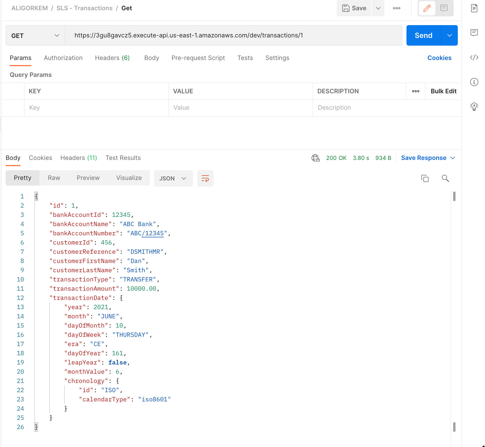
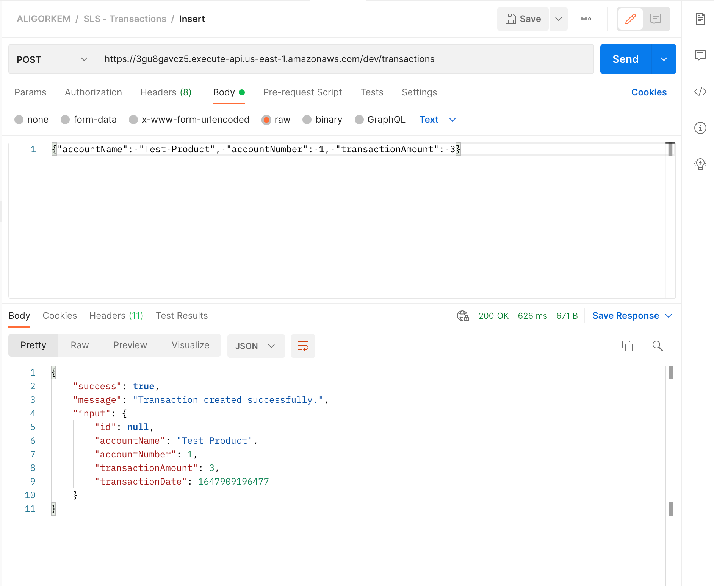
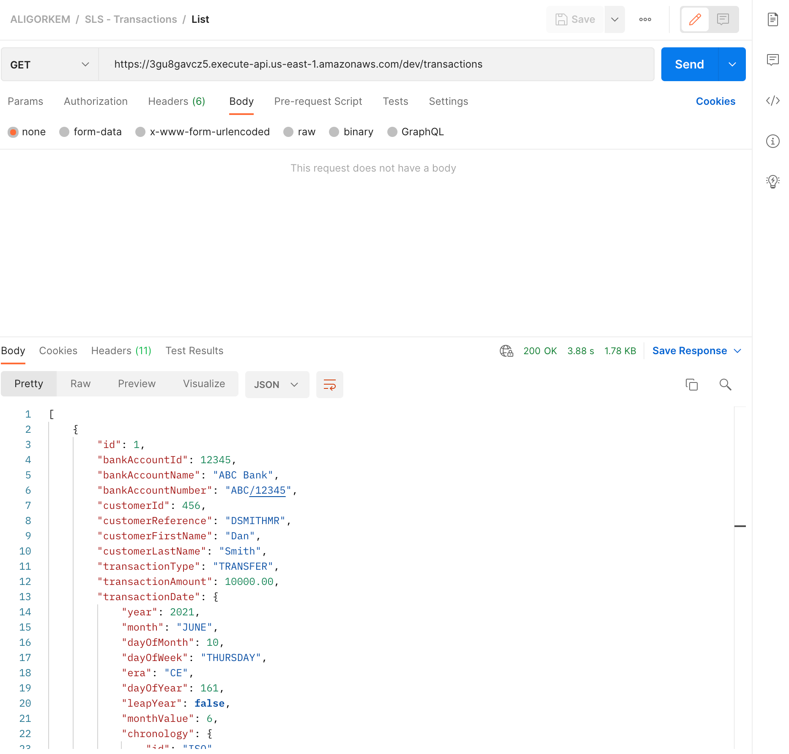

## Transactions-Lambda

This project demonstrates how to implement a serverless application with Java. The clean architecture and SOLID design principles applied to separate domain objects from external dependencies. Application, config, core and infrastructure layers of the application defined as packages in order to simplify the development. These packages could be created as a sub project.

### Prerequisites
- [Install JDK - 11 (LTS)](https://adoptopenjdk.net/)
- [Install Serverless Framework](https://www.serverless.com/)

### Setup

Clone the project and compile it:

    mvn clean install

Once you compile the project, deploy it using the serverless framework

    serverless deploy
    
You might need to set AWS keys in your local development machine.

#### REST Endpoints
1. Insert; curl --header "Content-Type: application/json" --request POST --data '{"accountName": "Test Product", "accountNumber": 1, "transactionAmount": 3}' https://3gu8gavcz5.execute-api.us-east-1.amazonaws.com/dev/transactions
2. Get; curl -X GET "https://3gu8gavcz5.execute-api.us-east-1.amazonaws.com/dev/transactions/1"
3. List; curl -X GET "https://3gu8gavcz5.execute-api.us-east-1.amazonaws.com/dev/transactions"

    

    

    

